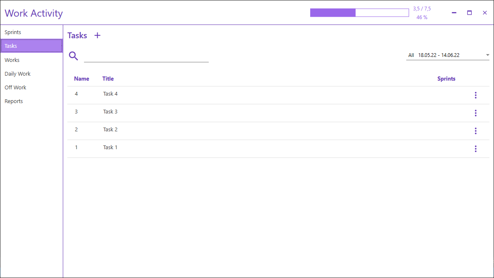

# Work Activity
Work Activity is a simple desktop app which provides reporting work time.
## Features
- create sprints with declared period
- create tasks
- create work items attached to task and report spent hours
- add holidays
- generate simple month report with expected, logged and missed hours
- progress bar with already logged hours
- save data as easy to read json files

## Screenshots

## License
GNU General Public License v3.0